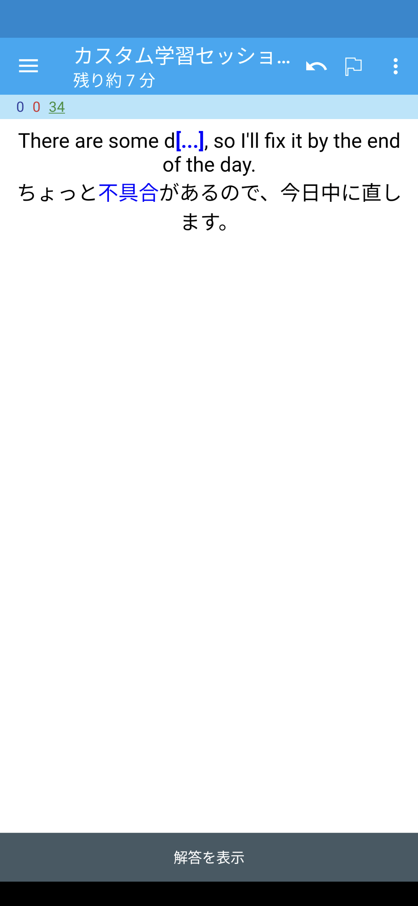
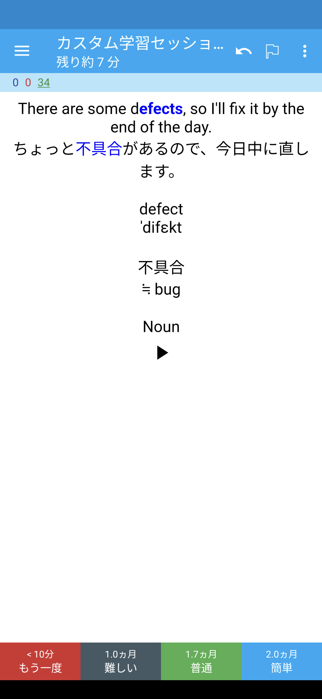

# Engineer Vocabulary List in Japanese/English エンジニア向け日英ボキャブラリーリスト

[Click here for the original README file.](docs/README-original.md)

## Anki flashcards

|Front|Back|
|---|---|
|||

The provided [Anki flashcard decks](https://apps.ankiweb.net/) use spaced repetition to help you retain English vocabulary for software developers.

- [エンジニアのための英語表現](https://ankiweb.net/shared/info/108891705)

Great for use while on-the-go.

## Contributing
> Learn from the community.

Feel free to submit pull requests to help:

- [Record example sentence audios](https://hinative.com/profiles/7148711/questions)
- Fix errors
- Improve vocabulary list
- Add new vocabulary
- Translate

## License

This repository is licensed under [CC BY 4.0](https://github.com/mercari/engineer-vocabulary-list/blob/master/LICENSE)
